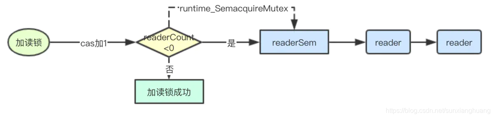
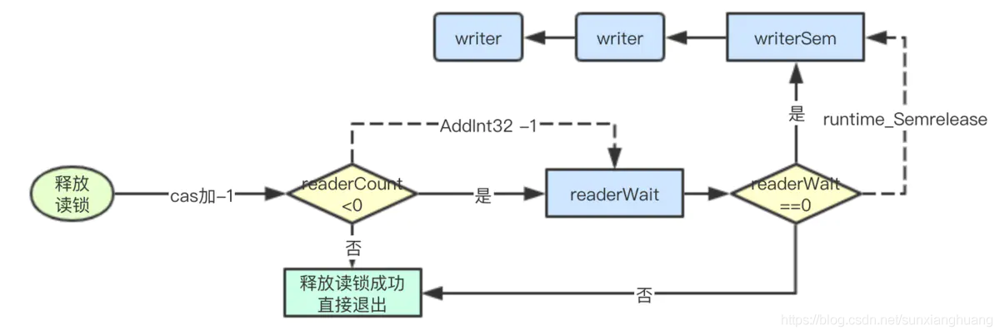
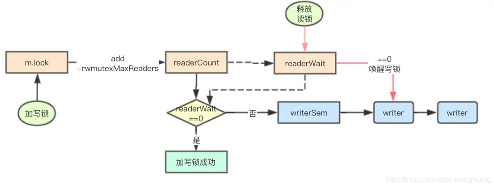

## golang读写锁

读写锁的主要区别就是读锁之间是共享的，多个goroutine可以同时加读锁，但是写锁与写锁、写锁与读锁之间则是互斥的

### 写锁饿死问题

因为读锁是共享的，所以如果当前已经有读锁，那后续goroutine继续加读锁正常情况下是可以加锁成功，但是如果一直有读锁进行加锁，那尝试加写锁的goroutine则可能会长期获取不到锁，这就是因为读锁而导致的写锁饥饿问题

```golang
type RWMutex struct {
    w           Mutex  // held if there are pending writers
    writerSem   uint32 // 用于writer等待读完成排队的信号量
    readerSem   uint32 // 用于reader等待写完成排队的信号量
    readerCount int32  // 读锁的计数器
    readerWait  int32  // 等待读锁释放的数量
}

```

### 读锁加锁过程



```golang
func (rw *RWMutex) RLock() {
    if race.Enabled {
        _ = rw.w.state
        race.Disable()
    }
    // 累加reader计数器，如果小于0则表明有writer正在等待
    if atomic.AddInt32(&rw.readerCount, 1) < 0 {
        // 当前有writer正在等待读锁，读锁就加入排队
        runtime_SemacquireMutex(&rw.readerSem, false)
    }
    if race.Enabled {
        race.Enable()
        race.Acquire(unsafe.Pointer(&rw.readerSem))
    }
}
```

### 读锁释放逻辑



```golang
func (rw *RWMutex) RUnlock() {
    if race.Enabled {
        _ = rw.w.state
        race.ReleaseMerge(unsafe.Pointer(&rw.writerSem))
        race.Disable()
    }
    // 如果小于0，则表明当前有writer正在等待
    if r := atomic.AddInt32(&rw.readerCount, -1); r < 0 {
        if r+1 == 0 || r+1 == -rwmutexMaxReaders {
            race.Enable()
            throw("sync: RUnlock of unlocked RWMutex")
        }
        // 将等待reader的计数减1，证明当前是已经有一个读的，如果值==0，则进行唤醒等待的
        if atomic.AddInt32(&rw.readerWait, -1) == 0 {
            // The last reader unblocks the writer.
            runtime_Semrelease(&rw.writerSem, false)
        }
    }
    if race.Enabled {
        race.Enable()
    }
}
```

### 加写锁实现



```golang
func (rw *RWMutex) Lock() {
    if race.Enabled {
        _ = rw.w.state
        race.Disable()
    }
    // 首先获取mutex锁，同时多个goroutine只有一个可以进入到下面的逻辑
    rw.w.Lock()
    // 对readerCounter进行进行抢占，通过递减rwmutexMaxReaders允许最大读的数量
    // 来实现写锁对读锁的抢占
    r := atomic.AddInt32(&rw.readerCount, -rwmutexMaxReaders) + rwmutexMaxReaders
    // 记录需要等待多少个reader完成,如果发现不为0，则表明当前有reader正在读取，当前goroutine需要进行排队等待
    if r != 0 && atomic.AddInt32(&rw.readerWait, r) != 0 {
        runtime_SemacquireMutex(&rw.writerSem, false)
    }
    if race.Enabled {
        race.Enable()
        race.Acquire(unsafe.Pointer(&rw.readerSem))
        race.Acquire(unsafe.Pointer(&rw.writerSem))
    }
}
```

### 释放写锁


```golang
```go
func (rw *RWMutex) Unlock() {
    if race.Enabled {
        _ = rw.w.state
        race.Release(unsafe.Pointer(&rw.readerSem))
        race.Disable()
    }

    // 将reader计数器复位，上面减去了一个rwmutexMaxReaders现在再重新加回去即可复位
    r := atomic.AddInt32(&rw.readerCount, rwmutexMaxReaders)
    if r >= rwmutexMaxReaders {
        race.Enable()
        throw("sync: Unlock of unlocked RWMutex")
    }
    // 唤醒所有的读锁
    for i := 0; i < int(r); i++ {
        runtime_Semrelease(&rw.readerSem, false)
    }
    // 释放mutex
    rw.w.Unlock()
    if race.Enabled {
        race.Enable()
    }
}
```

## 关键核心机制

### 写锁对读锁的抢占

> 加写锁的抢占
```golang
// 在加写锁的时候通过将readerCount递减最大允许加读锁的数量，来实现对加读锁的抢占
r := atomic.AddInt32(&rw.readerCount, -rwmutexMaxReaders) + rwmutexMaxReaders
```

> 加读锁的抢占检测
```golang
// 如果没有写锁的情况下读锁的readerCount进行Add后一定是一个>0的数字，这里通过检测值为负数
// 就实现了读锁对写锁抢占的检测
if atomic.AddInt32(&rw.readerCount, 1) < 0 {
    // A writer is pending, wait for it.
    runtime_SemacquireMutex(&rw.readerSem, false)
}
```

> 写锁抢占读锁后后续的读锁就会加锁失败，但是如果想加写锁成功还要继续对已经加读锁成功的进行等待

```golang
if r != 0 && atomic.AddInt32(&rw.readerWait, r) != 0 {
    // 写锁发现需要等待的读锁释放的数量不为0，就自己去休眠了
    runtime_SemacquireMutex(&rw.writerSem, false)
}
```

> 写锁既然休眠了，则必定要有一种唤醒机制其实就是每次释放锁的时候，当检查到有加写锁的情况下，就递减readerWait，并由最后一个释放reader lock的goroutine来实现唤醒写锁

```golang
if atomic.AddInt32(&rw.readerWait, -1) == 0 {
    // The last reader unblocks the writer.
    runtime_Semrelease(&rw.writerSem, false)
}
```

### 写锁的公平性

> 在加写锁的时候必须先进行mutex的加锁，而mutex本身在普通模式下是非公平的，只有在饥饿模式下才是公平的

```golang
rw.w.Lock()
```

### 写锁与读锁的公平性

在加读锁和写锁的工程中都使用atomic.AddInt32来进行递增，而该指令在底层是会通过LOCK来进行CPU总线加锁的，因此多个CPU同时执行readerCount其实只会有一个成功，从这上面看其实是写锁与读锁之间是相对公平的，谁先达到谁先被CPU调度执行，进行LOCK锁cache line成功，谁就加成功锁

### 可见性与原子性问题

在并发场景中特别是JAVA中通常会提到并发里面的两个问题：可见性与内存屏障、原子性， 其中可见性通常是指在cpu多级缓存下如何保证缓存的一致性，即在一个CPU上修改了了某个数据在其他的CPU上不会继续读取旧的数据。内存屏障通常是为了CPU提高流水线性能，而对指令进行重排序而来，而原子性则是指的执行某个操作的过程的不可分割
