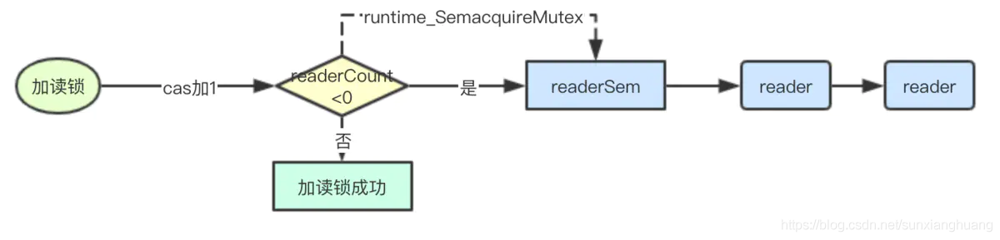
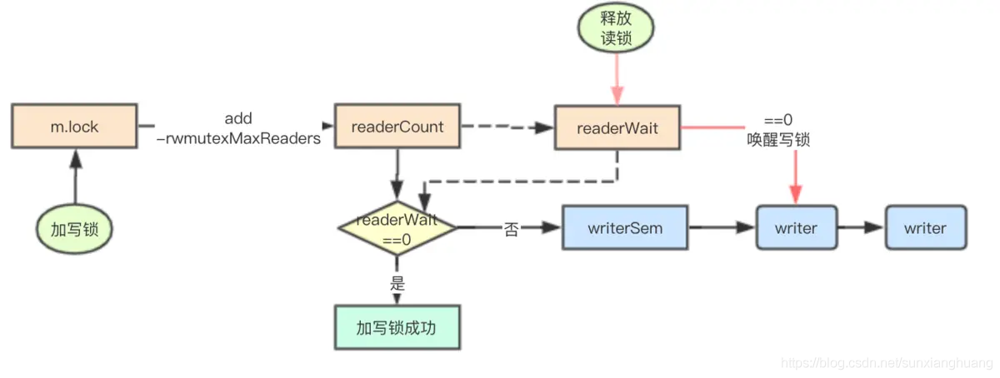

# 字节整理
## go调度

https://blog.csdn.net/yizhou35/article/details/108977664

### 3个缩写，请一定记住
G: goroutine

M: 工作线程

P: 处理器，它包含了运行Go代码的资源，M必须和一个P关联才能运行G。

### 调度器的有两大思想：

 * 复用线程：协程本身就是运行在一组线程之上，不需要频繁的创建、销毁线程，而是对线程的复用。
在调度器中复用线程还有2个体现：
 	1）work stealing，当本线程无可运行的G时，尝试从其他线程绑定的P偷取G，而不是销毁线程。
 	2）hand off，当本线程因为G进行系统调用阻塞时，线程释放绑定的P，把P转移给其他空闲的线程执行。

 * 利用并行：GOMAXPROCS设置P的数量，当GOMAXPROCS大于1时，就最多有GOMAXPROCS个线程处于运行状态，这些线程可能分布在多个CPU核上同时运行，使得并发利用并行。另外，GOMAXPROCS也限制了并发的程度，比如GOMAXPROCS = 核数/2，则最多利用了一半的CPU核进行并行。

### 调度器的两小策略：

  * 抢占：在coroutine中要等待一个协程主动让出CPU才执行下一个协程，在Go中，一个goroutine最多占用CPU`10ms`，防止其他goroutine被饿死，这就是goroutine不同于coroutine的一个地方。

  * 全局G队列：在新的调度器中依然有全局G队列，但功能已经被弱化了，当M执行work stealing从其

## golang读写锁

读写锁的主要区别就是读锁之间是共享的，多个goroutine可以同时加读锁，但是写锁与写锁、写锁与读锁之间则是互斥的

### 写锁饿死问题

因为读锁是共享的，所以如果当前已经有读锁，那后续goroutine继续加读锁正常情况下是可以加锁成功，但是如果一直有读锁进行加锁，那尝试加写锁的goroutine则可能会长期获取不到锁，这就是因为读锁而导致的写锁饥饿问题

```golang
type RWMutex struct {
    w           Mutex  // held if there are pending writers
    writerSem   uint32 // 用于writer等待读完成排队的信号量
    readerSem   uint32 // 用于reader等待写完成排队的信号量
    readerCount int32  // 读锁的计数器
    readerWait  int32  // 等待读锁释放的数量
}

```

### 读锁加锁过程



```golang
func (rw *RWMutex) RLock() {
    if race.Enabled {
        _ = rw.w.state
        race.Disable()
    }
    // 累加reader计数器，如果小于0则表明有writer正在等待
    if atomic.AddInt32(&rw.readerCount, 1) < 0 {
        // 当前有writer正在等待读锁，读锁就加入排队
        runtime_SemacquireMutex(&rw.readerSem, false)
    }
    if race.Enabled {
        race.Enable()
        race.Acquire(unsafe.Pointer(&rw.readerSem))
    }
}
```

### 读锁释放逻辑


```golang
func (rw *RWMutex) RUnlock() {
    if race.Enabled {
        _ = rw.w.state
        race.ReleaseMerge(unsafe.Pointer(&rw.writerSem))
        race.Disable()
    }
    // 如果小于0，则表明当前有writer正在等待
    if r := atomic.AddInt32(&rw.readerCount, -1); r < 0 {
        if r+1 == 0 || r+1 == -rwmutexMaxReaders {
            race.Enable()
            throw("sync: RUnlock of unlocked RWMutex")
        }
        // 将等待reader的计数减1，证明当前是已经有一个读的，如果值==0，则进行唤醒等待的
        if atomic.AddInt32(&rw.readerWait, -1) == 0 {
            // The last reader unblocks the writer.
            runtime_Semrelease(&rw.writerSem, false)
        }
    }
    if race.Enabled {
        race.Enable()
    }
}
```

### 加写锁实现



```golang
func (rw *RWMutex) Lock() {
    if race.Enabled {
        _ = rw.w.state
        race.Disable()
    }
    // 首先获取mutex锁，同时多个goroutine只有一个可以进入到下面的逻辑
    rw.w.Lock()
    // 对readerCounter进行进行抢占，通过递减rwmutexMaxReaders允许最大读的数量
    // 来实现写锁对读锁的抢占
    r := atomic.AddInt32(&rw.readerCount, -rwmutexMaxReaders) + rwmutexMaxReaders
    // 记录需要等待多少个reader完成,如果发现不为0，则表明当前有reader正在读取，当前goroutine需要进行排队等待
    if r != 0 && atomic.AddInt32(&rw.readerWait, r) != 0 {
        runtime_SemacquireMutex(&rw.writerSem, false)
    }
    if race.Enabled {
        race.Enable()
        race.Acquire(unsafe.Pointer(&rw.readerSem))
        race.Acquire(unsafe.Pointer(&rw.writerSem))
    }
}
```

### 释放写锁


```go
func (rw *RWMutex) Unlock() {
    if race.Enabled {
        _ = rw.w.state
        race.Release(unsafe.Pointer(&rw.readerSem))
        race.Disable()
    }

    // 将reader计数器复位，上面减去了一个rwmutexMaxReaders现在再重新加回去即可复位
    r := atomic.AddInt32(&rw.readerCount, rwmutexMaxReaders)
    if r >= rwmutexMaxReaders {
        race.Enable()
        throw("sync: Unlock of unlocked RWMutex")
    }
    // 唤醒所有的读锁
    for i := 0; i < int(r); i++ {
        runtime_Semrelease(&rw.readerSem, false)
    }
    // 释放mutex
    rw.w.Unlock()
    if race.Enabled {
        race.Enable()
    }
}
```