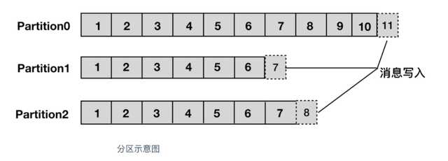
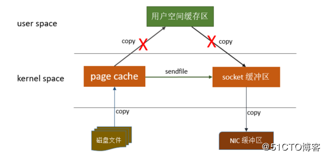

## kafka

### Kafka原理

 Kafka最初是由Linkedin公司开发，是一个分布式的、分区的、多副本的、多订阅者的，基于zookeeper协调的分布式日志系统（也可以当作MQ系统），常用于web/nginx日志、访问日志、消息服务等等。

### Kafka特性

* 高吞吐量、低延迟：kafka每秒可以处理几十万条消息，它的延迟最低只有几毫秒。
* 可扩展性：kafka集群支持热扩展。
* 持久性、可靠性：消息被持久化到本地磁盘，并且支持数据备份防止丢失。
* 容错性：允许集群中的节点失败（若分区副本数量为n，则允许n-1个节点失败）。
* 高并发：单机可支持数千个客户端同时读写。

### Kafka的应用场景

* 日志收集：一个公司可以用Kafka收集各种服务的log，通过kafka以统一接口开发给各种消费端，例如Hadoop、HBase、Solr等。
* 消息系统：解耦生产者和消费者、缓存消息等。
* 用户活动跟踪：Kafka经常用来记录web用户或者app用户的各种活动，例如浏览网页、搜索记录、点击等活动，这些活动信息被各个服务发布到kafka的topic中，然后订阅者通过订阅这些topic来做实时的监控分析，或者装载到hadoop、数据仓库中做离线分析和挖掘。
* 运营指标：Kafka也经常用来记录运营监控数据。
* 流式处理

### Kafka架构原理

整体来看，kafka架构中包含四大组件：生产者、消费者、kafka集群、zookeeper集群。
1. broker：kafka集群包含一个或多个服务器，每个服务器节点称为一个broker。
2. topic：每条发布到kafka集群的消息都有一个类别，这个类别称为topic，其实就是将消息按照topic来分类，topic就是逻辑上的分类，同一个topic的数据既可以在同一个broker上也可以在不同的broker节点上。
3. partition：分区，每个topic被物理划分为一个或多个分区，每个分区在物里上对应一个文件夹，该文件夹里面存储了这个分区的所有消息和索引文件。在创建topic时可指定parition数量，生产者将消息发送到topic时，消息会根据分区策略追加到分区文件的末尾，属于顺序写磁盘，因此效率非常高

4. offset：partition中的每条消息都被标记了一个序号，这个序号表示消息在partition中的偏移量，称为offset，每一条消息在partition都有唯一的offset，消费者通过指定offset来指定要消费的消息。正常情况下，消费者在消费完一条消息后会递增offset，准备去消费下一条消息，但也可以将offset设成一个较小的值，重新消费一些消费过的消息，可见offset是由consumer控制的，consumer来消费哪一条消息就消费哪一条消息，所以kafka broker 是无状态的，它不需要标记哪些消息被消费过。
5. producer：生产者，生产者发送消息到指定的topic下，消息再根据分配规则append到某个partition的末尾。
6. consumer：消费者，消费者从topic只能够消费数据
7. consumer group：消费者组，每一个consumer属于一个特定的consumer group，每个consumer指定consumer group，若不指定则属于默认的group。同一topic的一条消息只能被一个consumer group内的一个consumer消费，但多个consumer group可同时消费这一消息。这也是kafka用来实现一个topic消息的广播和单播的手段，如果需要实现广播，一个consumer group内只放一个消费者即可，要实现单播，将所有的消费者放到同一个consumer group即可。
8. leader：每个partition有多个副本，其中有且仅有一个作为leader，leader会负责所有的客户端读写操作。
9. follower：follower不对外提供服务，只与leader保持数据同步，如果leader失效，则选举一个follower来充当新的leader。当follower与leader挂掉、卡住或同步太慢，leader会把这个follower从ISR列表中删除，重新创建一个follower。
10. rebalance：同一个consumer group下的多个消费者互相协调消费工作，一个topic分为多个分区，一个consumer group里面的所有消费者合作，一起去消费所订阅的某个topic下的所有分区（每个消费者消费部分分区），kafka会将该topic下的所有分区均匀的分配给consumer group下的每个消费者。

rebalance表示“重平衡”，consumer group内某个消费者挂掉后，其他消费者自动重新分配订阅主题分区的过程，是kafka消费者端实现高可用的重要手段。
如图consumer group A中C2挂掉，C1会接收P1和P2，以达到重新平衡。同样的，当有新消费者加入consumer group，也会触发重平衡操作。

## kafka吞吐量为什么这么高
1. 顺序读写磁盘：kafka是将消息持久化到本地磁盘中的，一般人会认为磁盘读写性能差，可能会对kafka性能提出质疑。实际上不管是内存还是磁盘，快慢的关键在于寻址方式，磁盘分为顺序读写与随机读写，内存一样也分为顺序读写与随机读写。基于磁盘的随机读写确实很慢，但基于磁盘的顺序读写性能却很高。
2. page cache：为了优化读写性能，kafka利用了操作系统本身的page cache，就是利用操作系统本身的内存而不是JVM空间内存。这样做是因为，JVM中一切皆对象，对象的存储会带来额外的内存消耗；使用JVM会收到GC的影响，随着数据的增多，垃圾回收也会变得复杂与缓慢，降低吞吐量；另外操作系统本身对page cache做了大量优化，通过操作系统的page cache，kafka的读写操作基本上是基于系统内存的，读写性能也得到了极大的提升。
3. 零拷贝：是指kafka利用linux操作系统的“zero-copy”机制在消费端做的优化。
* 1、操作系统从磁盘读取数据到内核空间的page cache；
* 2、应用程序读取page cache的数据到用户空间的缓冲区；
* 3、应用程序将用户空间缓冲区的数据写回内核空间的socket缓冲区；
* 4、操作系统将数据从socket缓冲区复制到硬件的缓冲区

